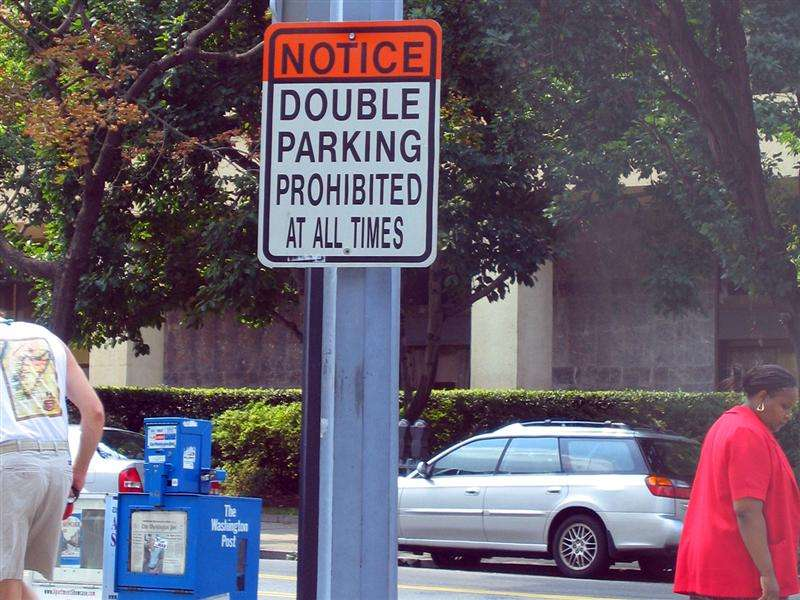

## gocvtext


Automatically detect and recognize text in natural images.

It calls OpenCV 3 API through SWIG and returns a slice of strings of recognized texts.
```
[AT All TIME PARKING PROHIBITED DOUBLE NOTICE]
```
## Requirements

- Mac OS X
- Go 1.4
- [OpenCV 3.0](http://opencv.org/downloads.html)
- [opencv_contrib](https://github.com/itseez/opencv_contrib)
- [Tesseract 3](https://github.com/tesseract-ocr)
- pkg-config

## Installation

[Install Go](https://golang.org/doc/install)

[Install OpenCV and opencv_contrib](http://www.pyimagesearch.com/2015/06/15/install-opencv-3-0-and-python-2-7-on-osx/)

Install Tesseract

```
brew install tesseract
```

Install pkg-config

```
brew install pkg-config
```

Install gocvtext package

```
go get github.com/vampirewalk/gocvtext
```
## Usage

```
package main

import (
	"fmt"
	"github.com/vampirewalk/gocvtext"
	"image"
	"os"
)

func main() {
	imgFilePath := "path/to/image"
	infile, err := os.Open(imgFilePath)
	if err != nil {
		panic(err)
	}
	defer infile.Close()

	img, _, err := image.Decode(infile)
	if err != nil {
		panic(err)
	}

	texts, err := gocvtext.Recognize(img)
	if err != nil {
		panic(err)
	}
	fmt.Println(texts)
}

```